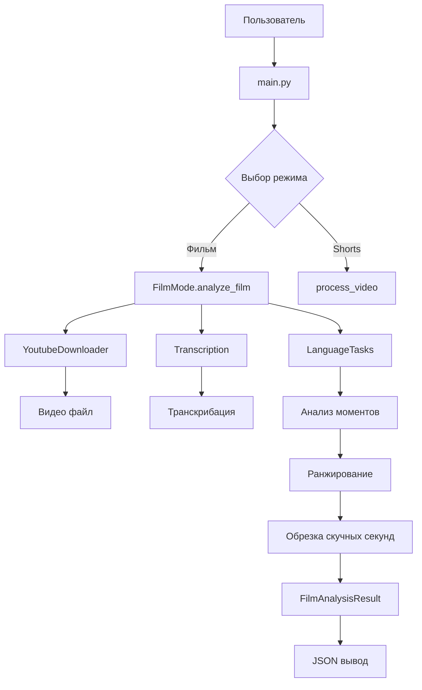

# Архитектура режима "фильм" для проекта обработки видео

## Обзор
Новый режим "фильм" предназначен для анализа длинных видео и выделения лучших моментов для создания компиляции. В отличие от режима shorts (создание отдельных коротких видео), режим фильм фокусируется на анализе всего контента и предложении оптимальных фрагментов для монтажа фильма.

## Основные требования
1. **Вход**: URL YouTube или локальный видеофайл
2. **Транскрибация**: Полная транскрибация с таймкодами
3. **Анализ моментов**: Поиск лучших моментов двух типов:
   - **COMBO** (10-20 сек): Склейка 2-4 коротких кусков из одной сцены
   - **SINGLE** (30-60 сек): Один самодостаточный момент
4. **Ранжирование**: По баллам с учетом специфики shorts:
   - **Эмоциональные пики и переломы статуса** (признания, угрозы, ультиматумы, резкие смены намерения)
   - **Конфликт и эскалация** (столкновения, отрицания, оскорбления)
   - **Панчлайны и остроумие** (связка сетап → поворот → панч, сарказм, самоирония)
   - **Цитатность/мемность** (запоминающиеся фразы, афоризмы, каламбуры)
   - **Ставки и цель** (если X, то Y, последний шанс)
   - **Крючки/клиффхэнгеры** (вопросы, недосказанность)
   - **Штраф за визуальную зависимость** (зависимость от визуального контекста)
5. **Обрезка**: Удаление скучных секунд (паузы >0.6-0.8 сек, филлеры) с сохранением ритма
6. **Вывод**: JSON с keep_ranges, scores, preview_text, risks

## Архитектура компонентов

### 1. FilmMode.py - Основной модуль режима фильм
```python
class FilmAnalyzer:
    def __init__(self, config: AppConfig):
        self.config = config
        self.db = VideoDatabase()

    def analyze_film(self, url: Optional[str] = None, local_path: Optional[str] = None) -> FilmAnalysisResult:
        """
        Основной пайплайн анализа фильма
        1. Получение видео
        2. Транскрибация
        3. Анализ моментов через ИИ
        4. Ранжирование
        5. Обрезка скучных секунд
        6. Формирование результата
        """
        pass

    def _get_video_and_transcription(self, ctx: ProcessingContext) -> bool:
        """Интеграция с YoutubeDownloader и Transcription"""
        pass

    def _analyze_moments(self, transcription_data: dict) -> List[FilmMoment]:
        """Анализ моментов через LanguageTasks"""
        pass

    def _rank_moments(self, moments: List[FilmMoment]) -> List[RankedMoment]:
        """Ранжирование моментов по баллам"""
        pass

    def _trim_boring_segments(self, moments: List[RankedMoment]) -> List[TrimmedMoment]:
        """Обрезка скучных секунд"""
        pass
```

### 2. Расширение LanguageTasks.py
```python
def analyze_film_moments(transcription: str, config: FilmConfig) -> List[FilmMoment]:
    """
    Анализ транскрибации для поиска лучших моментов фильма
    Использует Gemini для:
    - Выделения COMBO и SINGLE моментов
    - Оценки по критериям
    - Предложения обрезок
    """
    pass

def rank_moments_by_criteria(moments: List[FilmMoment], criteria_weights: dict) -> List[RankedMoment]:
    """
    Ранжирование моментов по баллам для shorts:
    - Эмоциональные пики и переломы статуса (emotional_peaks)
    - Конфликт и эскалация (conflict_escalation)
    - Панчлайны и остроумие (punchlines_wit)
    - Цитатность/мемность (quotability_memes)
    - Ставки и цель (stakes_goals)
    - Крючки/клиффхэнгеры (hooks_cliffhangers)
    - Штраф за визуальную зависимость (visual_penalty)
    """
    pass

def detect_boring_segments(transcription_data: dict, pause_threshold: float = 0.7) -> List[BoringSegment]:
    """
    Обнаружение скучных сегментов:
    - Длинные паузы (>0.6-0.8 сек)
    - Филлеры (э-э, м-м, ну)
    - Сохранение ритма
    """
    pass
```

### 3. Структуры данных
```python
@dataclass
class FilmMoment:
    moment_type: str  # "COMBO" или "SINGLE"
    start_time: float
    end_time: float
    text: str
    segments: List[dict]  # Для COMBO: список суб-сегментов
    context: str  # Описание контекста

@dataclass
class RankedMoment:
    moment: FilmMoment
    scores: dict  # {'emotions': 8.5, 'conflict': 7.2, ...}
    total_score: float
    rank: int

@dataclass
class FilmAnalysisResult:
    video_id: str
    duration: float
    keep_ranges: List[dict]  # [{'start': 10.5, 'end': 25.3, 'type': 'SINGLE', 'score': 8.7}]
    scores: List[dict]  # Детальные оценки
    preview_text: str  # Превью содержания
    risks: List[str]  # Потенциальные проблемы
    metadata: dict  # Дополнительная информация
```

### 4. Конфигурация (config.yaml)
```yaml
film_mode:
  enabled: true
  combo_duration: [10, 20]  # секунды
  single_duration: [30, 60]  # секунды
  max_moments: 15
  pause_threshold: 0.7  # секунды
  filler_words: ["э-э", "м-м", "ну", "эээ"]  # слова-заполнители

  ranking_weights:
    emotional_peaks: 0.20      # Эмоциональные пики и переломы статуса
    conflict_escalation: 0.18  # Конфликт и эскалация
    punchlines_wit: 0.16       # Панчлайны и остроумие
    quotability_memes: 0.14    # Цитатность/мемность
    stakes_goals: 0.12         # Ставки и цель
    hooks_cliffhangers: 0.10   # Крючки/клиффхэнгеры
    visual_penalty: -0.10      # Штраф за визуальную зависимость

  llm:
    model: "gemini-2.5-flash"
    temperature: 0.3
    max_attempts: 3
```

### 5. JSON схема вывода
```json
{
  "video_id": "master-ABC123",
  "duration": 1800.5,
  "keep_ranges": [
    {
      "start": 125.3,
      "end": 145.8,
      "type": "SINGLE",
      "score": 8.7,
      "text": "Ключевой момент обсуждения..."
    },
    {
      "start": 456.2,
      "end": 475.1,
      "type": "COMBO",
      "score": 9.2,
      "segments": [
        {"start": 456.2, "end": 465.0, "text": "Первая часть..."},
        {"start": 467.5, "end": 475.1, "text": "Вторая часть..."}
      ]
    }
  ],
  "scores": [
    {
      "moment_id": "single_1",
      "emotional_peaks": 8.5,
      "conflict_escalation": 7.2,
      "punchlines_wit": 9.1,
      "quotability_memes": 8.8,
      "stakes_goals": 7.9,
      "hooks_cliffhangers": 6.5,
      "visual_penalty": 0.5,
      "total": 8.7
    }
  ],
  "preview_text": "Фильм содержит 12 лучших моментов длительностью 8.5 минут из оригинальных 30 минут видео...",
  "risks": [
    "Момент 3 может содержать спорный контент",
    "Необходимо проверить авторские права на музыку в фоне"
  ],
  "metadata": {
    "processed_at": "2025-01-15T10:30:00Z",
    "model_version": "gemini-2.5-flash",
    "total_segments_analyzed": 45
  }
}
```

## Интеграция с существующими компонентами

### YoutubeDownloader
- Используется без изменений
- Возвращает путь к видео для дальнейшей обработки

### Transcription
- Используется transcribe_unified()
- Получаем полную транскрибацию с сегментами и словами

### LanguageTasks
- Расширяется новыми функциями анализа фильма
- Использует существующие утилиты для работы с LLM

### Database
- Расширяется для хранения результатов анализа фильма
- Добавляются таблицы для film_analysis_results

## Порядок реализации

1. **Создание FilmMode.py** - основной модуль
2. **Расширение LanguageTasks.py** - функции анализа
3. **Обновление config.yaml** - настройки режима
4. **Модификация main.py** - добавление выбора режима
5. **Расширение Database.py** - хранение результатов
6. **Интеграционное тестирование**

## Диаграмма архитектуры



## Критерии успеха

- ✅ Корректная интеграция с существующими компонентами
- ✅ Точный анализ моментов по заданным критериям
- ✅ Надежное ранжирование и обрезка
- ✅ Структурированный JSON вывод
- ✅ Масштабируемость для разных типов видео
- ✅ Обработка ошибок и edge cases

## Риски и mitigation

1. **Производительность**: Анализ длинных видео может быть ресурсоемким
   - Решение: Пагинация обработки, кэширование промежуточных результатов

2. **Качество анализа**: LLM может давать неконсистентные результаты
   - Решение: Валидация результатов, fallback стратегии

3. **Интеграция**: Конфликты с существующим кодом
   - Решение: Тщательное тестирование, постепенная интеграция

4. **Сложность**: Новый режим добавляет complexity
   - Решение: Четкое разделение ответственности, документация